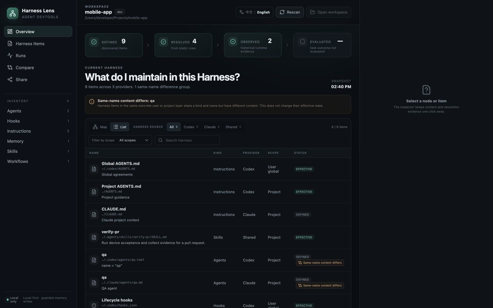
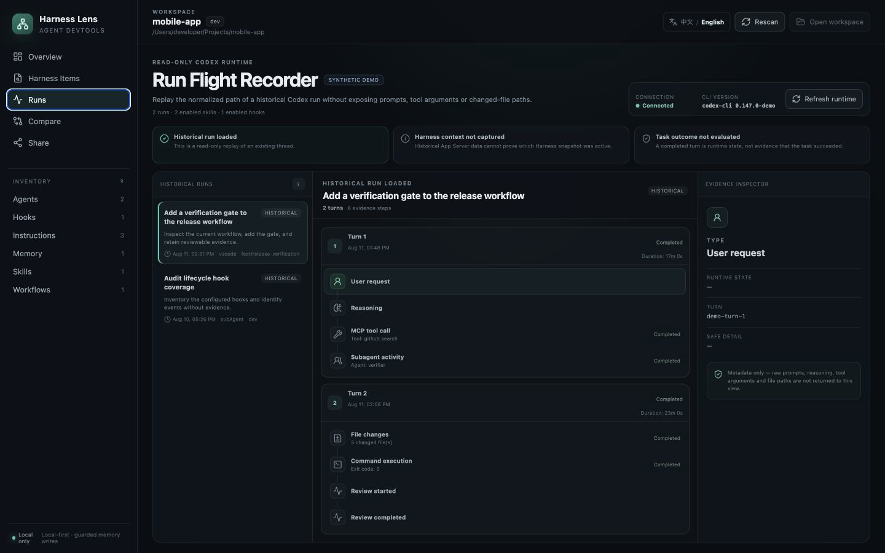

# Harness Lens

[](https://github.com/zhanhaoyu99/harness-lens/actions/workflows/ci.yml)
[](LICENSE)
[](#install)

**See what Codex and Claude context exists for a project, what current adapters can resolve, what changed, and what a run exposed.**

Harness Lens is a local-first Agent Harness inspector, Codex run flight recorder, and configuration snapshot diff for macOS. It makes scattered coding-agent context inspectable without uploading your repository or raw run content to a Harness Lens service.

Harness Lens helps answer two deceptively hard questions:

1. What rules, skills, hooks, agents, config, and memory can affect this workspace?
2. What path did a real Codex run take?

It scans local Codex and Claude Harness sources, explains their origin and resolution, and can connect to the experimental Codex App Server as a metadata-only “flight recorder.” It does not execute agents or upload scanned content to a Harness Lens service. Harness sources remain read-only except for an explicit, confirmed edit of an existing recognized Memory Markdown file.

Typical uses include:

- auditing which `AGENTS.md`, rules, skills, hooks, config, and Memory are defined, which can be resolved by the current adapters, and which remain unknown before asking Codex to work;
- explaining why Codex and Claude see different project context;
- replaying the metadata-only path of a persisted Codex thread;
- capturing two Harness revisions and identifying configuration changes before blaming the model.

[简体中文](README.zh-CN.md)

**[Try the live synthetic demo](https://zhanhaoyu99.github.io/harness-lens/)** · **[Download the macOS arm64 app](https://github.com/zhanhaoyu99/harness-lens/releases/latest)** · **[Share feedback](https://github.com/zhanhaoyu99/harness-lens/issues/new?template=compatibility_report.yml)**

The browser build uses generated examples only. It cannot scan local files or connect to your local Codex runtime.


**31-second synthetic tour:** inventory what can affect a workspace → replay the metadata-only path of a Codex run → compare two explicitly saved Harness snapshots. The tour demonstrates product behavior, not task-success evaluation.

## Why another Agent DevTool?

Agent behavior is shaped by more than a prompt. User-level rules, repository instructions, skills, hooks, memory, working directory, runtime version, and orchestration all contribute. These inputs are usually distributed across files and runtime state, which makes failures difficult to reproduce or compare.

Harness Lens keeps four different claims separate:

| Stage | Question | Evidence available today |
|---|---|---|
| **Defined** | Does the item exist? | Local file or runtime declaration |
| **Resolved** | Does it apply in this workspace? | Scope, precedence, trust, and runtime resolution metadata |
| **Observed** | Did a run expose or use it? | Codex run/turn/item metadata |
| **Evaluated** | Did the task succeed? | Independent verifier or evaluation — not implemented yet |

A completed run is **not** proof that the task succeeded. Harness Lens deliberately avoids turning activity into an evaluation claim.

## Detailed previews

All screenshots below use synthetic data. The browser demo cannot read local files.






## What works today

- Scan a selected workspace plus known user-level Codex and Claude Harness locations.
- Distinguish user-global, project, nested-project, and project-bound sources; nested workspaces are scanned along their repository-to-workspace chain.
- Browse instructions, rules, skills, hooks, agents, config, memory, and workflows in Map or List form.
- Inspect scope, provider, source, resolution reason, duplicate groups, and redacted previews.
- Separate Codex, Claude, shared, and other discovered Harness sources with composable source, scope, type, and search filters.
- Load Memory text only when requested and explicitly edit eligible project or user-maintained Memory Markdown files with conflict detection and confirmation.
- Connect to the experimental Codex App Server for current skills/hooks and recent workspace threads.
- Replay a Codex thread as a linear, metadata-only sequence of turns and item types.
- Explicitly capture an immutable, metadata-only Harness snapshot without turning ordinary workspace scans into history.
- Reopen the latest 50 captures for a workspace and compare two saved snapshots for observed configuration changes.
- Copy an aggregate-only Markdown snapshot that excludes file contents and absolute paths.
- Switch between English and Chinese; the first launch follows the system language.
- Run the filesystem scan headlessly without opening the desktop app.

The run recorder normalizes allowlisted metadata. It does not display raw prompts, tool arguments, model reasoning, or file diffs.

## v0.4.0 scope

v0.4.0 is focused on **local Harness revision history**, not run evaluation. Choosing a workspace or using Rescan continues to update only the live view and does not write history. When the user explicitly chooses Capture, the backend performs a fresh scan and atomically saves a capture referencing an immutable, content-addressed, metadata-only snapshot. History stays isolated by workspace, retains the latest 50 explicit captures, and includes an explicitly confirmed action for clearing that workspace's history.

The Compare page compares two **saved** snapshots from the same workspace. It explains observed additions, removals, content-hash changes, resolution changes, and diagnostic changes while keeping incomplete scans visibly qualified. Persisted history excludes Harness file content and previews, raw Memory text, absolute paths, prompts, reasoning, tool arguments, file diffs, and raw runtime responses.

This scope does not bind a Codex run to a snapshot. Existing and newly listed runs will continue to show that Harness context was not captured; Harness Lens will not infer a binding from the nearest scan time. Adapter-backed execution-time capture remains later M2 work.

## Install

### Release build

The current distribution targets **Apple Silicon (macOS arm64, macOS 11+)**. Download the `.dmg` and its checksum from [GitHub Releases](https://github.com/zhanhaoyu99/harness-lens/releases), then verify it:

```bash
shasum -a 256 -c Harness-Lens_0.4.0_aarch64.dmg.sha256
```

Current release artifacts are ad-hoc signed and **not notarized by Apple**. Gatekeeper may warn or block the app. Only open it through macOS Privacy & Security after verifying the checksum and deciding that you trust this project. Building from source is the safest option while notarization is pending.

### Build from source

Requirements:

- macOS 11 or later on Apple Silicon
- Node.js 22+
- pnpm 11
- Rust 1.88 or later with `rustfmt` and `clippy`
- Xcode Command Line Tools

```bash
git clone https://github.com/zhanhaoyu99/harness-lens.git
cd harness-lens
corepack enable
pnpm install --frozen-lockfile
pnpm tauri dev
```

## Validate and package

```bash
# Frontend unit tests and production build
pnpm test
pnpm build

# Rust tests, formatting, and lints
pnpm rust:test
sh scripts/with-rust.sh cargo fmt --manifest-path src-tauri/Cargo.toml --all -- --check
sh scripts/with-rust.sh cargo clippy --manifest-path src-tauri/Cargo.toml --all-targets -- -D warnings

# Dependency advisories (install cargo-audit once with `cargo install cargo-audit --locked`)
pnpm audit --prod
sh scripts/with-rust.sh cargo audit --file src-tauri/Cargo.lock

# Headless diagnostic summary (contains workspace path and branch; keep it local)
pnpm scan -- /path/to/workspace

# Reviewable aggregate compatibility report (no workspace paths, names, content, artifact hashes, or branch)
pnpm compatibility-report -- /path/to/workspace

# Local app and DMG
pnpm tauri build
```

Bundles are written below `src-tauri/target/release/bundle/` (or a target-specific directory when cross-compiling).

## Privacy and safety boundaries

- **Local-first:** there is no Harness Lens cloud account or telemetry pipeline.
- **Read-only by default:** Rules, Skills, Hooks, Agents, Config, workflows, and Codex threads are never modified. Only eligible, already-scanned Memory Markdown files can be changed after an explicit save confirmation.
- **Opt-in raw Memory:** Memory text is not included in the normal snapshot or Share output. It reaches the editor only after the user asks to view that file and may contain unredacted sensitive text.
- **Explicit scope:** scanning starts from a workspace chosen by the user plus documented user-level Harness locations.
- **Best-effort redaction:** common secret patterns are redacted before previews, but no redactor can guarantee that arbitrary sensitive text is removed.
- **Conservative sharing:** desktop Share performs a fresh, read-only disk scan and shows the complete schema-v1 aggregate report before the user explicitly copies it. Unsaved Memory drafts stay local to the editor and are not scanned.
- **Experimental runtime:** Codex App Server compatibility can change. Runtime errors are shown instead of silently fabricating evidence.

Treat all previews and screenshots as potentially sensitive. Review anything before sharing it. See [Privacy](docs/PRIVACY.md), [Threat model](docs/THREAT-MODEL.md), and [Security policy](SECURITY.md).

## Project status

Harness Lens is an early, actively maintained open-source project. The current release supports local inspection, scoped Memory management, and Codex run forensics, but it does not yet bind a historical run to an immutable Harness snapshot, calculate trustworthy per-run cost, or judge task success.

v0.4.0 adds metadata-only snapshot history plus Saved-to-Saved Harness comparison. It does not close the run-binding or verifier evidence gaps.

The roadmap prioritizes those evidence boundaries over adding orchestration features. See [Roadmap](docs/ROADMAP.md), [Product direction](docs/PRODUCT.md), [Architecture](docs/ARCHITECTURE.md), and the [versioned compatibility evidence](docs/COMPATIBILITY.md).

## Contributing

Issues, reproducible fixtures, provider-compatibility reports, privacy reviews, and focused pull requests are welcome. Start with [CONTRIBUTING.md](CONTRIBUTING.md). By participating, you agree to the [Code of Conduct](CODE_OF_CONDUCT.md).

If you use Codex or Claude Code, one of the most useful early contributions is a [safely redacted compatibility report](https://github.com/zhanhaoyu99/harness-lens/issues/new?template=compatibility_report.yml). In the v0.5 desktop candidate, open Share, generate a fresh report, inspect every field, then copy it explicitly; source builders can use the CLI shown above. A report that confirms a documented workflow is useful too—it helps separate real support from assumptions without exposing your Harness content.

If you build from source, `pnpm compatibility-report -- /path/to/workspace` creates a versioned aggregate starting point. Review it before sharing: counts can still reveal information about a setup. See the [report contract](docs/COMPATIBILITY-REPORT.md).

## License

[MIT](LICENSE) © 2026 Zane
