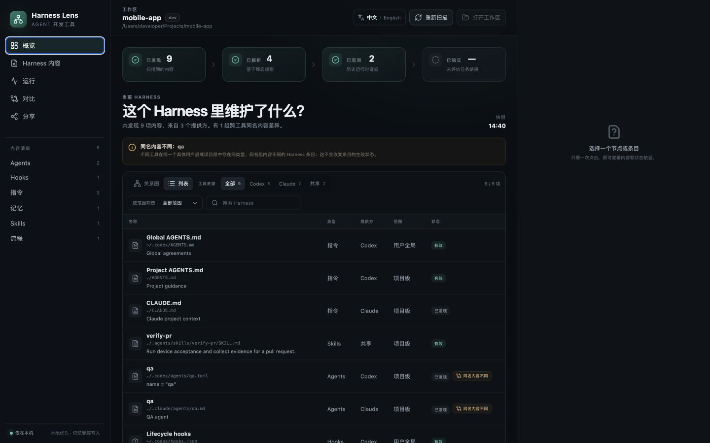
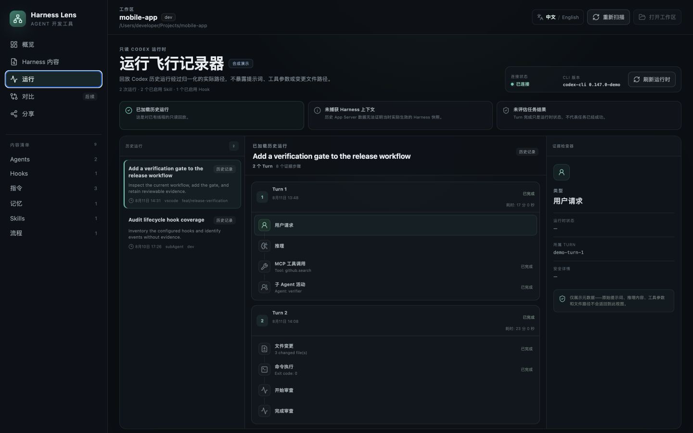

# Harness Lens

[](https://github.com/zhanhaoyu99/harness-lens/actions/workflows/ci.yml)
[](LICENSE)
[](#安装)

**一个本地优先、只读的 Agent Harness Control Plane / Agent DevTools。**

Harness Lens 想先回答两个看似简单、实际很难的问题：

1. 当前工作区会受到哪些 Rules、Skills、Hooks、Agents、配置与 Memory 影响？
2. 一次真实的 Codex 任务实际走过了怎样的路径？

它会扫描本机的 Codex 与 Claude Harness 来源，解释内容的来源和解析状态，并可连接实验性的 Codex App Server，把运行信息呈现成只包含元数据的「飞行记录」。它不会执行 Agent、修改 Harness，也不会把扫描内容上传到 Harness Lens 服务。

[English](README.md)

**[打开在线合成数据 Demo](https://zhanhaoyu99.github.io/harness-lens/)** ——浏览器版本只使用生成的示例数据，无法扫描本地文件，也无法连接你本机的 Codex Runtime。

## 为什么需要新的 Agent DevTools？

Agent 的行为并不只由一段 Prompt 决定。用户级规则、仓库指令、Skills、Hooks、Memory、工作目录、运行时版本以及编排流程都会参与其中。这些输入通常散落在文件和运行时状态中，让失败难以复现，也很难比较 Harness 改动是否真的有效。

Harness Lens 会严格区分四类结论：

| 阶段 | 要回答的问题 | 当前可用证据 |
|---|---|---|
| **Defined（已定义）** | 这个内容存在吗？ | 本地文件或运行时声明 |
| **Resolved（已解析）** | 它会应用到当前工作区吗？ | 作用域、优先级、信任状态和运行时解析元数据 |
| **Observed（已观察）** | 一次运行是否暴露或使用了它？ | Codex Run / Turn / Item 元数据 |
| **Evaluated（已评估）** | 任务真的成功了吗？ | 独立 Verifier 或 Eval——当前尚未实现 |

一次 Run 显示「完成」，并不等于任务结果正确。Harness Lens 不会把活动记录包装成评估结论。

## 界面预览

以下截图均使用完全合成的数据，浏览器演示版不能读取本地文件。





## v0.1 已实现

- 扫描用户选择的工作区，以及已知的用户级 Codex / Claude Harness 位置。
- 通过 Map 或 List 浏览 Instructions、Rules、Skills、Hooks、Agents、Config、Memory 和 Workflows。
- 查看作用域、Provider、来源、解析原因、重复组和经过脱敏的预览。
- 连接实验性的 Codex App Server，读取当前 Skills / Hooks 与工作区最近的 Threads。
- 将 Codex Thread 重放为只包含元数据的线性 Turn / Item 序列。
- 复制只包含聚合统计的 Markdown 快照，不包含文件内容与绝对路径。
- 支持中文和英文，首次启动跟随系统语言。
- 不打开桌面窗口也能执行 Headless 文件扫描。

Run Recorder 只保留白名单中的元数据，不展示原始 Prompt、工具参数、模型推理或文件 Diff。

## 安装

### Release 版本

首个版本仅支持 **Apple Silicon（macOS arm64，macOS 11+）**。从 [GitHub Releases](https://github.com/zhanhaoyu99/harness-lens/releases) 下载 `.dmg` 及校验文件，然后验证：

```bash
shasum -a 256 -c Harness-Lens_0.1.1_aarch64.dmg.sha256
```

当前产物采用 ad-hoc 签名，**尚未经过 Apple Notarization**。Gatekeeper 可能弹出警告或阻止启动。请先核对校验值并确认信任本项目，再通过 macOS「隐私与安全性」手动打开。在完成公证前，从源码构建是更稳妥的方式。

### 从源码运行

依赖：

- Apple Silicon Mac，macOS 11+
- Node.js 22+
- pnpm 11
- stable Rust，并安装 `rustfmt`、`clippy`
- Xcode Command Line Tools

```bash
git clone https://github.com/zhanhaoyu99/harness-lens.git
cd harness-lens
corepack enable
pnpm install --frozen-lockfile
pnpm tauri dev
```

## 验证与打包

```bash
# 前端单元测试与生产构建
pnpm test
pnpm build

# Rust 测试、格式和静态检查
pnpm rust:test
sh scripts/with-rust.sh cargo fmt --manifest-path src-tauri/Cargo.toml --all -- --check
sh scripts/with-rust.sh cargo clippy --manifest-path src-tauri/Cargo.toml --all-targets -- -D warnings

# 依赖安全公告（先运行一次 `cargo install cargo-audit --locked`）
pnpm audit --prod
sh scripts/with-rust.sh cargo audit --file src-tauri/Cargo.lock

# 不含文件内容的 Headless 工作区摘要
pnpm scan -- /path/to/workspace

# 本地 .app 与 DMG
pnpm tauri build
```

产物位于 `src-tauri/target/release/bundle/`；交叉编译时会位于对应 target 目录。

## 隐私与安全边界

- **本地优先：**没有 Harness Lens 云端账号或遥测链路。
- **只读：**不会修改 Harness 文件，也不会恢复、启动或删除 Codex Thread。
- **明确范围：**扫描从用户选择的工作区以及文档声明的用户级 Harness 位置开始。
- **尽力脱敏：**常见密钥模式会在进入预览前被处理，但任何脱敏器都无法保证识别所有任意敏感文本。
- **保守分享：**v0.1 的 Share 只输出聚合统计。
- **实验性运行时：**Codex App Server 的兼容性可能变化；连接错误会明确显示，不会伪造证据。

请把预览和截图都视为可能包含敏感信息，分享前务必人工检查。详见[隐私说明](docs/PRIVACY.md)、[威胁模型](docs/THREAT-MODEL.md)和[安全策略](SECURITY.md)。

## 项目状态

Harness Lens 是一个早期、持续维护的开源项目。v0.1 已可用于本地 Harness 检查与 Codex Run 排查，但还不能把历史 Run 与不可变的 Harness 快照准确绑定，也不能提供可信的单次成本或判断任务是否成功。

Roadmap 会优先补齐这些证据边界，而不是先扩展编排能力。详见 [Roadmap](docs/ROADMAP.md)、[产品方向](docs/PRODUCT.md)、[架构](docs/ARCHITECTURE.md)和[版本化兼容性证据](docs/COMPATIBILITY.md)。

## 参与贡献

欢迎提交 Issue、可复现 Fixture、Provider 兼容性反馈、隐私审查和范围明确的 Pull Request。请先阅读 [CONTRIBUTING.md](CONTRIBUTING.md)。参与社区即表示同意遵守 [Code of Conduct](CODE_OF_CONDUCT.md)。

## License

[MIT](LICENSE) © 2026 Zane
