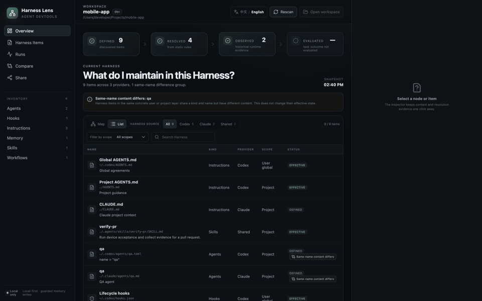
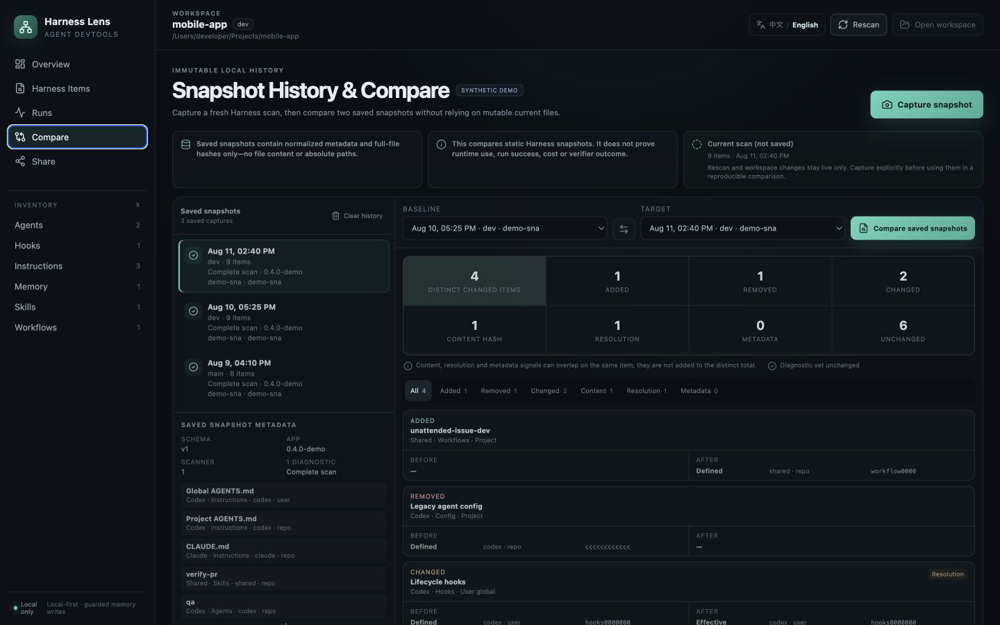

# Harness Lens

[](https://github.com/zhanhaoyu99/harness-lens/actions/workflows/ci.yml)
[](LICENSE)
[](#安装)

**查看项目中有哪些 Codex 与 Claude 上下文、当前适配器能解析哪些内容、发生了什么变化，以及一次运行暴露了什么。**

Harness Lens 是一个面向 macOS 的本地优先 Agent Harness 检查器、Codex 运行记录器和配置快照对比工具。它能把分散的编码 Agent 上下文变成可检查证据，而无需把仓库或原始运行内容上传到 Harness Lens 服务。

Harness Lens 想先回答两个看似简单、实际很难的问题：

1. 当前工作区会受到哪些 Rules、Skills、Hooks、Agents、配置与 Memory 影响？
2. 一次真实的 Codex 任务实际走过了怎样的路径？

它会扫描本机的 Codex 与 Claude Harness 来源，解释内容的来源和解析状态，并可连接实验性的 Codex App Server，把运行信息呈现成只包含元数据的「飞行记录」。它不会执行 Agent，也不会把扫描内容上传到 Harness Lens 服务。除用户明确确认编辑一个已识别的 Memory Markdown 文件外，Harness 来源保持只读。

典型用途包括：

- 在让 Codex 开始工作前，审计有哪些 `AGENTS.md`、Rules、Skills、Hooks、Config 和 Memory，哪些能被当前适配器解析，以及哪些仍是未知状态；
- 解释 Codex 与 Claude 为什么会看到不同的项目上下文；
- 以仅元数据方式回放一个已持久化 Codex 任务的实际路径；
- 捕获两次 Harness 版本，在把问题归因给模型前先确认配置改了什么。

[English](README.md)

**[体验在线合成数据 Demo](https://zhanhaoyu99.github.io/harness-lens/)** · **[下载 macOS arm64 应用](https://github.com/zhanhaoyu99/harness-lens/releases/latest)** · **[分享使用反馈](https://github.com/zhanhaoyu99/harness-lens/issues/new?template=compatibility_report.yml)**

浏览器版本只使用生成的示例数据，无法扫描本地文件，也无法连接你本机的 Codex Runtime。



**31 秒合成数据演示：**盘点会影响工作区的 Harness 内容 → 仅以元数据回放一次 Codex 运行路径 → 对比两份显式保存的 Harness 快照。该演示只展示产品行为，不代表任务结果评估。

## 为什么需要新的 Agent DevTools？

Agent 的行为并不只由一段 Prompt 决定。用户级规则、仓库指令、Skills、Hooks、Memory、工作目录、运行时版本以及编排流程都会参与其中。这些输入通常散落在文件和运行时状态中，让失败难以复现，也很难比较 Harness 改动是否真的有效。

Harness Lens 会严格区分四类结论：

| 阶段 | 要回答的问题 | 当前可用证据 |
|---|---|---|
| **Defined（已定义）** | 这个内容存在吗？ | 本地文件或运行时声明 |
| **Resolved（已解析）** | 它会应用到当前工作区吗？ | 作用域、优先级、信任状态和运行时解析元数据 |
| **Observed（已观察）** | 一次运行是否暴露或使用了它？ | Codex Run / Turn / Item 元数据 |
| **Evaluated（已评估）** | 任务真的成功了吗？ | 独立 Verifier 或 Eval——当前尚未实现 |

一次 Run 显示「完成」，并不等于任务结果正确。Harness Lens 不会把活动记录包装成评估结论。

## 详细界面预览

以下截图均使用完全合成的数据，浏览器演示版不能读取本地文件。




## 当前已实现

- 扫描用户选择的工作区，以及已知的用户级 Codex / Claude Harness 位置。
- 区分用户全局、项目级、子项目级与项目绑定来源；选择仓库内子目录时，会沿仓库根目录到当前工作区的路径识别各层 Harness。
- 通过 Map 或 List 浏览 Instructions、Rules、Skills、Hooks、Agents、Config、Memory 和 Workflows。
- 查看作用域、Provider、来源、解析原因、重复组和经过脱敏的预览。
- 通过可组合的来源、范围、类型和搜索筛选，直接区分 Codex、Claude、共享及其他已发现的 Harness 内容。
- 仅在用户主动点击后加载 Memory 正文，并在显式确认、冲突检测的保护下编辑符合条件的项目级或用户维护 Memory Markdown 文件。
- 连接实验性的 Codex App Server，读取当前 Skills / Hooks 与工作区最近的 Threads。
- 将 Codex Thread 重放为只包含元数据的线性 Turn / Item 序列。
- 显式捕获不可变、仅包含元数据的 Harness 快照，同时保持普通工作区扫描不写入历史。
- 重新打开一个工作区最近 50 次 Capture，并比较两份已保存快照中观测到的配置变化。
- 复制只包含聚合统计的 Markdown 快照，不包含文件内容与绝对路径。
- 支持中文和英文，首次启动跟随系统语言。
- 不打开桌面窗口也能执行 Headless 文件扫描。

Run Recorder 只保留白名单中的元数据，不展示原始 Prompt、工具参数、模型推理或文件 Diff。

## v0.4.0 版本范围

v0.4.0 聚焦于**本地 Harness 版本历史**，而不是运行结果评估。普通的“选择工作区”和“重新扫描”只更新 Live Scan，不会写入历史。只有用户显式点击“Capture”后，后端才会重新执行一次 fresh scan，并原子保存一条引用不可变、内容寻址、仅包含元数据快照的 Capture。历史记录按工作区隔离，每个工作区固定保留最近 50 次显式 Capture，并提供需要明确确认的“清除此工作区历史”操作。

对比页只比较同一工作区中的两份**已保存快照（Saved ↔ Saved）**，解释观测到的新增、移除、内容哈希变化、解析状态变化和诊断变化；如果扫描不完整，结论会继续明确标注边界。持久化历史不会保存 Harness 文件正文或预览、Memory 原文、绝对路径、Prompt、推理、工具参数、文件 Diff 或原始 Runtime Response。

这一范围不会把 Codex Run 绑定到快照。无论已有 Run 还是新出现在列表里的 Run，仍会明确显示“未捕获 Harness 上下文”；Harness Lens 不会根据时间最接近的扫描推断绑定关系。由 Runtime Adapter 支持的执行时捕获仍属于后续 M2 工作。

## 安装

### Release 版本

当前分发版本仅支持 **Apple Silicon（macOS arm64，macOS 11+）**。从 [GitHub Releases](https://github.com/zhanhaoyu99/harness-lens/releases) 下载 `.dmg` 及校验文件，然后验证：

```bash
shasum -a 256 -c Harness-Lens_0.4.0_aarch64.dmg.sha256
```

当前产物采用 ad-hoc 签名，**尚未经过 Apple Notarization**。Gatekeeper 可能弹出警告或阻止启动。请先核对校验值并确认信任本项目，再通过 macOS「隐私与安全性」手动打开。在完成公证前，从源码构建是更稳妥的方式。

### 从源码运行

依赖：

- Apple Silicon Mac，macOS 11+
- Node.js 22+
- pnpm 11
- Rust 1.88 或更高版本，并安装 `rustfmt`、`clippy`
- Xcode Command Line Tools

```bash
git clone https://github.com/zhanhaoyu99/harness-lens.git
cd harness-lens
corepack enable
pnpm install --frozen-lockfile
pnpm tauri dev
```

## 验证与打包

```bash
# 前端单元测试与生产构建
pnpm test
pnpm build

# Rust 测试、格式和静态检查
pnpm rust:test
sh scripts/with-rust.sh cargo fmt --manifest-path src-tauri/Cargo.toml --all -- --check
sh scripts/with-rust.sh cargo clippy --manifest-path src-tauri/Cargo.toml --all-targets -- -D warnings

# 依赖安全公告（先运行一次 `cargo install cargo-audit --locked`）
pnpm audit --prod
sh scripts/with-rust.sh cargo audit --file src-tauri/Cargo.lock

# Headless 诊断摘要（包含工作区路径和分支，请仅在本地使用）
pnpm scan -- /path/to/workspace

# 可人工检查的聚合兼容性报告（不含工作区路径、名称、正文、制品哈希或分支）
pnpm compatibility-report -- /path/to/workspace

# 本地 .app 与 DMG
pnpm tauri build
```

产物位于 `src-tauri/target/release/bundle/`；交叉编译时会位于对应 target 目录。

## 隐私与安全边界

- **本地优先：**没有 Harness Lens 云端账号或遥测链路。
- **默认只读：**Rules、Skills、Hooks、Agents、Config、Workflows 和 Codex Thread 都不会被修改；只有已扫描且符合条件的 Memory Markdown 可以在明确确认后保存。
- **Memory 原文按需加载：**正文不会进入常规快照或 Share；只有用户主动查看时才进入编辑器，并可能包含未经脱敏的敏感内容。
- **明确范围：**扫描从用户选择的工作区以及文档声明的用户级 Harness 位置开始。
- **尽力脱敏：**常见密钥模式会在进入预览前被处理，但任何脱敏器都无法保证识别所有任意敏感文本。
- **保守分享：**桌面端 Share 会重新执行一次只读磁盘扫描，完整展示 schema v1 聚合报告，并只在用户明确操作后复制。未保存的 Memory 草稿只留在编辑器中，不会进入扫描。
- **实验性运行时：**Codex App Server 的兼容性可能变化；连接错误会明确显示，不会伪造证据。

请把预览和截图都视为可能包含敏感信息，分享前务必人工检查。详见[隐私说明](docs/PRIVACY.md)、[威胁模型](docs/THREAT-MODEL.md)和[安全策略](SECURITY.md)。

## 项目状态

Harness Lens 是一个早期、持续维护的开源项目。当前版本已支持本地 Harness 检查、分层 Memory 管理与 Codex Run 排查，但还不能把历史 Run 与不可变的 Harness 快照准确绑定，也不能提供可信的单次成本或判断任务是否成功。

v0.4.0 已加入 metadata-only 快照历史与 Saved ↔ Saved Harness 对比，但不会在本轮补齐 Run Binding 或 Verifier 证据。

Roadmap 会优先补齐这些证据边界，而不是先扩展编排能力。详见 [Roadmap](docs/ROADMAP.md)、[产品方向](docs/PRODUCT.md)、[架构](docs/ARCHITECTURE.md)和[版本化兼容性证据](docs/COMPATIBILITY.md)。

## 参与贡献

欢迎提交 Issue、可复现 Fixture、Provider 兼容性反馈、隐私审查和范围明确的 Pull Request。请先阅读 [CONTRIBUTING.md](CONTRIBUTING.md)。参与社区即表示同意遵守 [Code of Conduct](CODE_OF_CONDUCT.md)。

如果你正在使用 Codex 或 Claude Code，当前最有价值的早期贡献之一，是提交一份[经过安全脱敏的兼容性报告](https://github.com/zhanhaoyu99/harness-lens/issues/new?template=compatibility_report.yml)。在 v0.5 桌面候选版中，打开 Share，生成一份新的报告，逐项检查后再明确复制；源码用户也可使用上方 CLI。即使结果是“按文档正常工作”也有价值：它能帮助项目把真实支持范围与推测区分开，同时不暴露你的 Harness 正文。

如果你从源码运行，可以先执行 `pnpm compatibility-report -- /path/to/workspace` 生成一份有版本的聚合报告。分享前仍需人工检查，因为计数也可能透露环境信息。字段契约见[兼容性报告说明](docs/COMPATIBILITY-REPORT.md)。

## License

[MIT](LICENSE) © 2026 Zane
